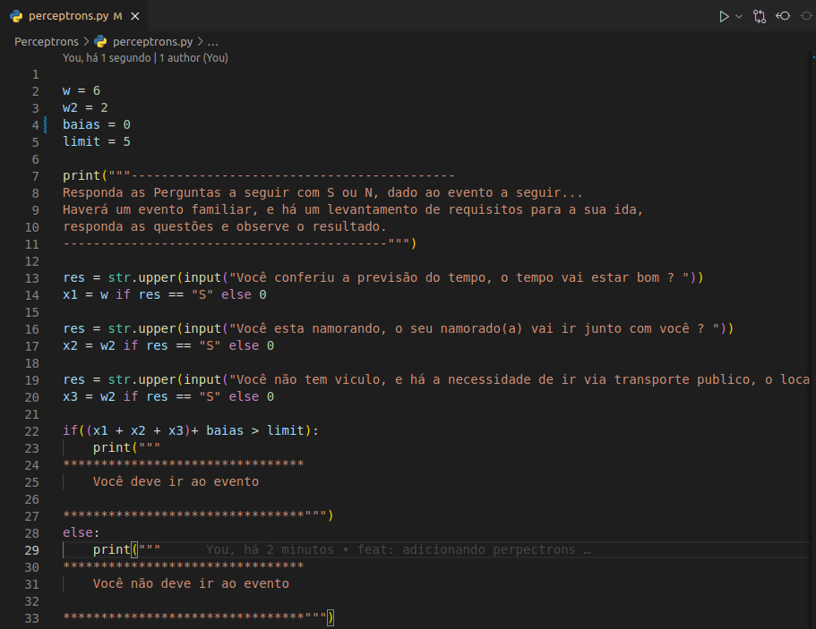
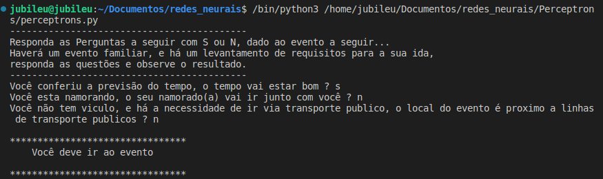
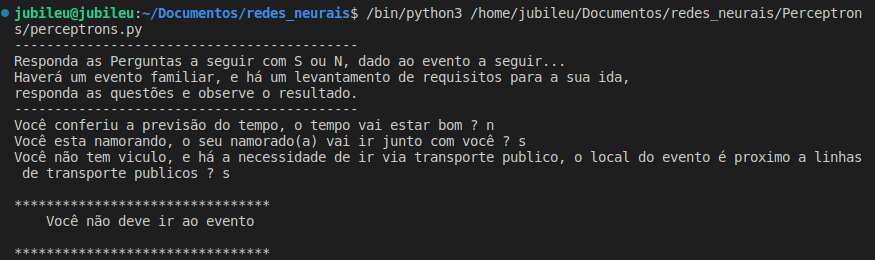
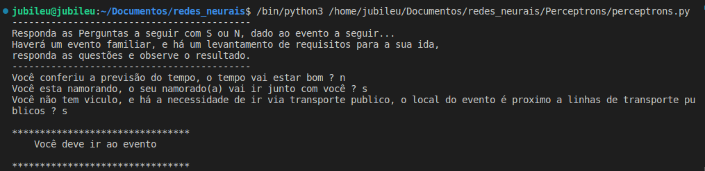
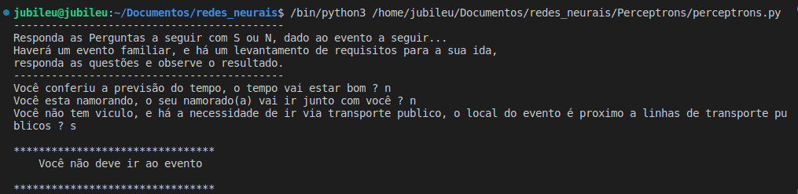
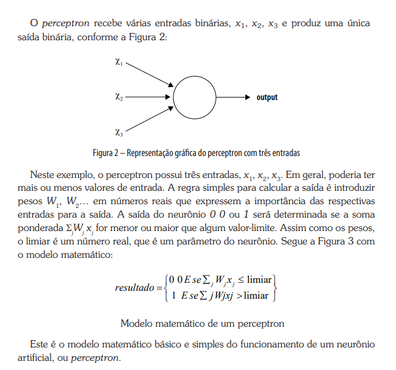

<h1>Perceptrons</h1>

Um perceptron é o bloco de construção básico de uma RNA. Ele recebe várias entradas e produz uma saída com base em pesos atribuídos a essas entradas e um limite. Pode ser usado para tomar decisões simples.

<h2>A seguir, podemos conferir um exemplo simples para demonstrar como um perceptron funciona</h2>

Para um melhor entendimento, vamos entender cada dado neste arquivo:

<table>
  <thead>
    <tr>
      <th>Campo</th>
      <th>Valor</th>
    </tr>
    <tr>
      <th>W</th>
      <td>Peso 1</td>
    </tr>
    <tr>
      <th>W2</th>
      <td>Peso 2 e 3</td>
    </tr>
    <tr>
      <th>Bias</th>
      <td>Valor Bias</td>
    </tr>
    <tr>
      <th>Limit</th>
      <td>Valor Limiar</td>
    </tr>
    <tr>
      <th>x1</th>
      <td>Input 1</td>
    </tr>
    <tr>
      <th>x2</th>
      <td>Input 2</td>
    </tr>
    <tr>
      <th>x3</th>
      <td>Input 3</td>
    </tr>
  </thead>
</table>

 Dada a narrativa apresentada, podemos ter algumas resoluções. A primeira pergunta tem o peso 6, já a segunda e terceira têm peso 2. Como definimos o Limit em 5 e deixamos o valor do Bias em 0, podemos ter apenas duas respostas:

 1º - Se a primeira resposta for SIM, independente das outras respostas, o retorno será "Você deve ir ao evento".

 2º - Se a primeira resposta for NÃO, independente das outras respostas, o retorno será "Você não deve ir ao evento" 

 

<strong>Mas se fizermos uma pequena alteração no limite para 3 em vez de 5, temos as seguintes resoluções:</strong>

 1º - Se a primeira resposta for NÃO, e as outras respostas forem SIM, o retorno será "Você deve ir ao evento".

 2º - Se a primeira resposta for SIM, independente das outras respostas, o retorno será "Você deve ir ao evento".

 3º - Se a primeira resposta for NÃO, e outra resposta for NÃO, o retorno será "Você deve ir ao evento".

  

Sendo assim, podemos identificar que se alterarmos o limiar da equação, o retorno será diferente do exemplo anterior, e como usamos os Perceptrons para retornarem <strong>(≈0)</strong> ou <strong>(≈1)</strong>, poderíamos alterar nossa saída para 0 quando: "Você não deve ir ao evento" e 1 quando: "Você deve ir ao evento". Outra leitura com fim de exemplo seria a comparação de 1 para True e 0 para False.

